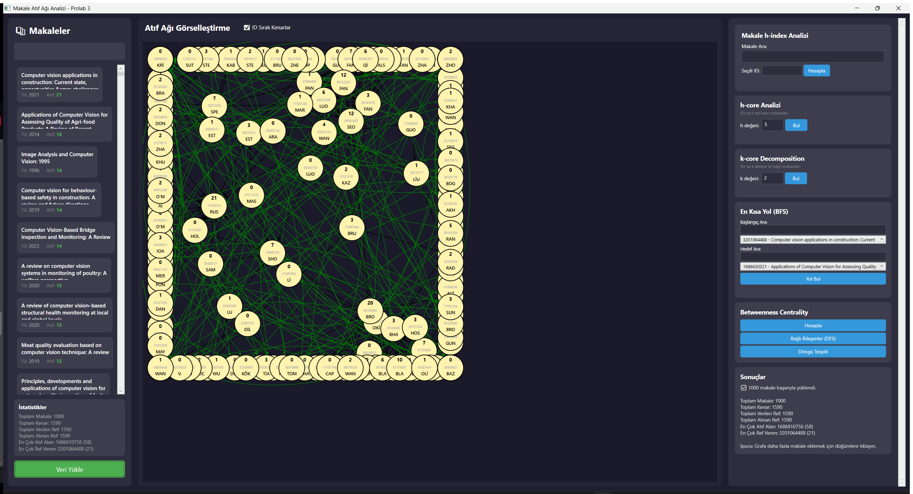
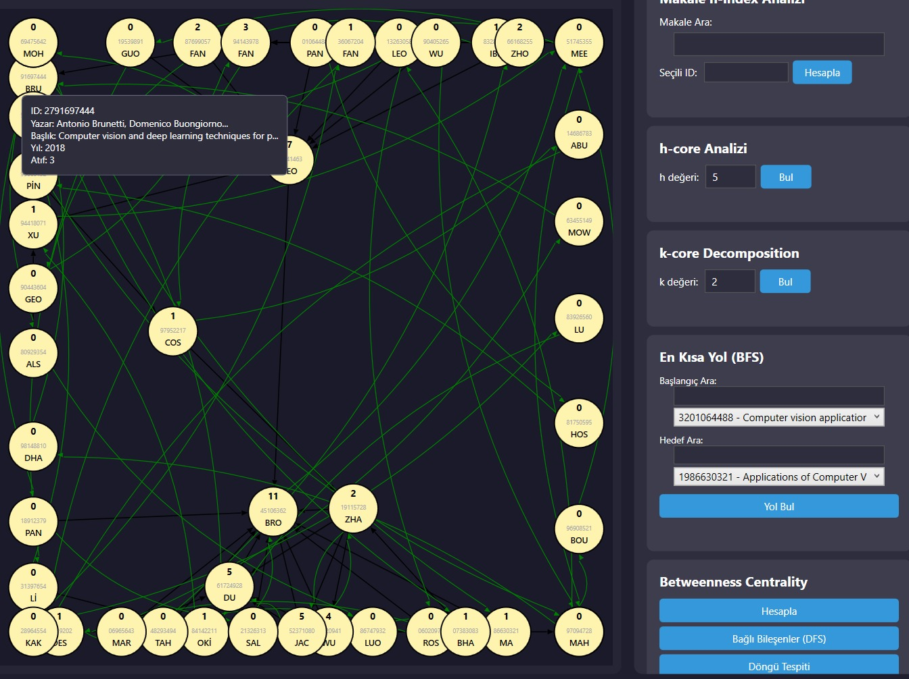
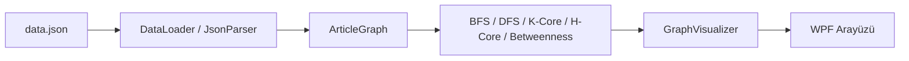

# Sosyal Ağ / Atıf Grafiği Analizi

Akademik makaleler arasındaki atıf (citation) ilişkilerini bir graf olarak modelleyip; gezinme, merkezilik ve topluluk (core) analizleri yapan C# / WPF masaüstü uygulaması.



*1000 makale, 1590 atıf ilişkisi içeren gerçek veri seti yüklenmiş hâli.*

Bir makale düğümünün üzerine gelindiğinde detay bilgisi (ID, yazar, başlık, yıl, atıf sayısı) gösterilir:



## Mimari



## Özellikler

- Makale verisini (`Data/data.json`) DOI, yazar, yıl, anahtar kelime ve referans bilgileriyle birlikte yükleme (`DataLoader`, `JsonParser`)
- Graf üzerinde **BFS** ve **DFS** ile gezinme
- **Betweenness Centrality** (arasındalık merkeziliği) hesaplama
- **K-Core** ve **H-Core** alt graf ayrıştırma algoritmaları
- Sonuçların `GraphVisualizer` ile görselleştirilmesi

## Teknoloji

- C# / .NET (WPF)
- JSON tabanlı veri kümesi (OpenAlex tarzı makale/atıf verisi)

## Çalıştırma

Visual Studio veya `dotnet` CLI ile açıp derleyin:

```bash
dotnet run --project SocialNetworkAnalysis.csproj
```

`start.bat` ile de derleyip çalıştırabilirsiniz.
